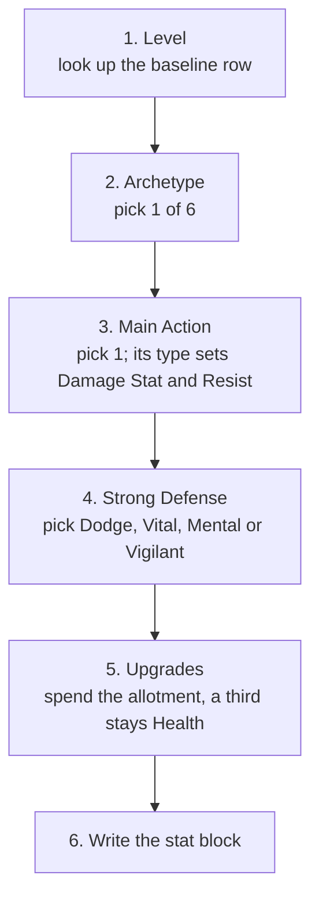

# GM guide notes

Loose notes toward an eventual GM-facing guide — a holding pen, not a
commitment, same treatment as `IDEAS_BACKLOG.md`. `rulebook.md` is
player-facing only by explicit design (see `RULES_DESIGN.md`'s scoping
note on this), so "how should a GM actually run X" guidance doesn't
belong there; it collects here until there's enough for a real GM guide
to get drafted as its own thing (a new rulebook chapter tagged for GM
eyes, a separate page, whatever that ends up being). Move a section out
once it's actually been drafted somewhere real, rather than leaving a
stale duplicate here.

## Planning loot: Materials vs. Gold

Surfaced while reviewing whether Crafting Schools' XP cost pays off
(see `balance.md`'s Open Balance Work section) — the payoff model only
works if the GM actually hands out Materials as loot, not just Gold, so
this is really GM-facing advice as much as it's a balance finding.

**The core mechanic**: Materials are worth Gold equal to their Level,
but per `rulebook.md`, most Materials sell for "much less" than that
except to specific tradespeople, and even they're unlikely to pay full
value (Precious Materials are the stated exception — those sell at full
value). A working number for that discount: **a vendor pays roughly
50-75% of a Material's Level-equivalent Gold value.** Crafting with the
Material instead keeps its **full** value — checked at both the cheap
end (a 3 Gold Camping Kit's 3 materials: 1.5-2.25 Gold sold vs. 3 Gold
crafted) and the expensive end (a Level 1 Masterwork's 20 materials:
10-15 Gold sold vs. 20 Gold crafted) in `balance.md`'s resolution — same
25-50% recovery either way.

**What this means for planning loot, if a GM wants that payoff to
actually show up in play:**
- Materials need to actually enter the loot table, not just Gold — the
  same instinct as older-style D&D handing out a painting or a jeweled
  statue instead of a coin count, per the designer's own framing. A
  treasure hoard that's 100% Gold gives a crafting-invested character
  nothing to convert.
- A Material's Level should be something the party can plausibly use —
  handing out Level 4-5 Materials to a party whose Craft/Mixology Skill
  Totals cap around 2-3 is loot they can't act on except by selling it
  at the discount (defeating the point), the same "don't outpace what
  a build can use yet" instinct that governs how Techniques/thresholds
  get paced by Level elsewhere in the game.
- Mixing in some Precious Materials (full sale value, per the
  rulebook's stated exception) alongside the "sells at a discount"
  types gives a GM a lever: more Precious-heavy loot reads as
  straightforwardly liquid treasure, more of the discounted types
  reads as "this table rewards crafting investment" — a knob to turn
  based on how much the group actually leans on the Builder's Crafting
  tab, rather than one fixed ratio being correct for every table.
- Since the actual payoff a School earns back is proportional to
  *volume* of Materials converted over a character's career (not which
  specific item gets built — see `balance.md`'s finding that the
  recovery percentage is identical at every price tier), a GM weighing
  whether to bother with Material loot at all should think of it as
  "does this table want Crafting School XP to have been worth
  spending," not "is this specific treasure haul balanced."

**Not yet answered here, left for whenever a real GM guide gets
drafted**: any concrete guidance on *how much* Material loot to hand
out per session/arc/character Level — that needs actual play data or a
deliberate design pass, not just this session's back-of-envelope check,
so it's deliberately left open rather than asserting a number with
nothing behind it.

## Why Materials exist as their own resource, not just abstracted into Gold

The two sections above are both tactical ("how much to hand out," "what
counts as loot") — this one is the theory underneath them, for a GM who
wants to understand *why* the system is built this way before running it,
not just what to do.

**Materials exist so that "what got looted" and "what a crafting-invested
character can build" are the literal same object**, not two separate
systems a GM has to reconcile by hand. A game that only tracked Gold
would still let characters buy their way to a Masterwork enchantment, but
the fiction would be thin — nothing about *finding* the loot would matter,
only its price tag. Materials keep the connective tissue: the frost
wyrm's hide the party skinned isn't just "40 Gold of loot," it's Frost
Material, at that wyrm's own Level, sitting in the party's pack until
someone with Craft/Mixology and the right School decides what to build
with it. The reward and the story of getting it stay attached to each
other all the way to the character sheet.

**The Level gate is what keeps that connection meaningful instead of
decorative.** A Material must be at least as high-Level as whatever it's
used to build (`rulebook.md`'s Materials rule), so a GM doesn't need to
hand-pick "is this the right reward for this party" beyond keeping drops
roughly on-Level the way any other loot already gets paced — the system
does the rest. This cuts both directions, and both are worth watching for:
underleveled Materials pile up as dead weight a crafting character can
still use for something eventually but can't act on *now* (Level 4-5
loot dropped on a Level 1-3 party, see the Planning Loot section above),
while a GM who never varies drop Level at all denies higher-Level
characters anything worth spending their build investment on.

**Material *Type*, separate from Level, is the GM's actual worldbuilding
lever here — this is the more interesting knob to turn, and the easier
one to overlook.** Mundane Types (Bone, Cloth, Leather, Metal, Wood) read
as "what a creature or a person's gear is made of" and show up anywhere
that fits — a bandit camp, a butchered monster, a ruined workshop.
Elemental and exotic Types (Fire, Frost, Brilliant, Shadow, Medicinal,
Precious) read as "what this specific place or creature is *about*," and
dropping them is a cheap, mechanically-real way to make an encounter's
theme carry forward: a frost-touched dungeon that actually drops Frost
Materials lets a player walk out with a tangible reason to go build
something Frost-flavored, not just a settings detail that stopped
mattering the moment the fight ended. Since the Masterwork catalog is
deliberately built for **Material Type variety within a Level**, not just
raw Level progression (see `balance.md`'s Material Type × Level coverage
work), a GM leaning into this has real choices waiting on the other end —
the loot placement isn't just flavor, it's steering which part of the
catalog a character actually has a reason to reach for.

**Masterwork's flat 20-Materials-per-item convention (regardless of
Level) means a GM doesn't have to scale *how much* loot a location drops
to keep pace with character Level** — only *what Level* it's at. The
gathering effort for a Level 1 enchantment and a Level 5 one is the same
raw count; only the Gold-equivalent value (and therefore how rare/potent
each individual Material dropped should feel) goes up. That's one less
axis a GM has to consciously manage when pacing a dungeon's loot table
against the party's own progression.

## Running Social Encounters: pacing and difficulty, from the Social Encounter Baseline model

`rulebook.md`'s Social Challenges section deliberately leaves
successes-needed and Pressure's accrual rate to GM judgment, same as it
leaves combat encounter difficulty to GM judgment. To have *some* real
numbers to calibrate against instead of pure guesswork, `design/
balance_weights_notes.md`'s **Social Encounter Baseline** built a
representative scenario and ran the actual math on it (exact
combinatorics, cross-checked against Monte Carlo) — a reasonably-built
four-person party (one lead at +6 Skill Total, three Supporters at +4
each), 5 successes needed, Pressure climbing by 1 every round and
hitting the lead Statement *and* every Support check, failing outright
at Pressure 5. This is GM-facing guidance built on top of that model,
not a repeat of its derivation — see that file if the underlying math
needs checking.

**This model represents a prolonged Encounter specifically — most
social interactions should still resolve as the single check `rulebook.
md` already describes.** Reach for the Pressure/multi-round shape (and
the pacing below) when the scene has real stakes riding on a drawn-out
negotiation or interrogation, not for "can you talk your way past the
gate guard." Calling for Pressure tracking on every minor social beat
will wear the mechanic out fast and make it feel punishing rather than
tense.

**The expected shape, round by round** (numbers from the locked
Baseline, `balance_weights_notes.md`'s own table):

| Round | Pressure that round | Roughly how it should feel |
|---|---|---|
| 1 | none yet | The lead's Statement almost always lands (100% in the model) — this round is about setting up the scene, not real risk. |
| 2 | 1 | Still favored, but Support starts visibly struggling (its success chance roughly drops by two-thirds from round 1). |
| 3 | 2 | The real swing round — cumulative win odds cross 50% right around here. |
| 4 | 3 | Genuinely tense; Support is now only occasionally landing. |
| 5 | 4 | Do-or-die — if the party hasn't closed it out by now, the odds are against them (~57% overall win rate across the whole encounter, ~43% real chance of a scripted failure). |

A GM running this by feel rather than pulling out a calculator should
expect: an easy-feeling opening round, a real sense of things getting
harder starting around round 3, and a genuine chance of failure by
round 5 that the table should be allowed to actually land — don't
quietly fudge it toward success just because it's a social scene rather
than combat. **43% is not a small number; be ready to actually play out
what "the party loses this Encounter" means** (per `rulebook.md`'s
Interrupted Encounter / Results of a Social Encounter guidance) rather
than treating failure as a hypothetical that never happens at the
table.

**The single biggest lever is how freely the GM lets players spend
cards from their hand to rescue a near-miss** (`rulebook.md`'s "Your
Hand and Playing Cards" — playing a card from hand to replace one
already flipped). The Baseline explicitly assumes a party has a
suitable card free "most of the time," and that assumption alone is
most of what keeps the win rate in a reasonable band: the exact same
scenario without it only wins **9.72%** of the time, against 57.03%
with it. In practice, that means: don't be stingy about letting a
player search their hand for something that saves a failing Statement
or Support check when a Social Encounter's Pressure is mounting — that
generosity isn't a house-rule kindness, it's load-bearing for the
difficulty actually landing where it's designed to. A table that plays
cards close to the chest (hoarding hand cards for combat, rarely
spending them socially) should expect Social Encounters to run
noticeably harder than the numbers above suggest, closer to the ~10%
floor than the ~57% baseline.

**Two known gaps between this model and the literal rulebook text**,
worth knowing about since they mean real play may run a bit differently
than the table above:
- The Baseline assumes Support checks scale in difficulty with the
  specific Statement they're backing (Difficulty 13 → Support needs
  ≥9). The actual Supporting rule is a **flat Difficulty 11** for every
  Support check regardless of what's being supported, which would put a
  +4 Supporter's threshold at ≥7 instead — noticeably easier. If Support
  is landing more often at the table than the numbers above imply,
  that's expected, not a sign something's off.
- The Baseline counts **every card drawn from a Good/Bad Luck flip**
  toward that flip's suit pool for Extra Success purposes (not just the
  one card actually used for pass/fail) — a real reading of the
  existing Extra Success rule, but not yet spelled out anywhere in
  `rulebook.md` for the multi-card case. This affects Good/Bad Luck
  checks generally, combat included, not just Social Encounters — worth
  applying consistently at the table either way once you're using it.

**Pressure's ignore-vs-remove distinction** (`rulebook.md`'s Pressure
section) matters for pacing too: an effect that lets the party *ignore*
Pressure softens a round's Bad Luck without slowing the failure clock
down at all, while one that actually *removes* Pressure buys real extra
rounds. When a player asks whether their item/Technique effect ends the
encounter's countdown faster, that's the question to check against —
"ignore" keeps today's round easier but Round 5 is still Round 5;
"remove" genuinely pushes it back.

## Judgment calls: a player wants to use a material that's not on the list

A few quick pointers for the recurring "can I use X for this" moment at
the table, surfaced while tidying up `crafting_recipes.csv`'s own Main/
Optional Types (see `RULES_DESIGN.md`'s Crafting Schools entry for the
full pass).

- **The Type system is deliberately coarse — a recipe names a handful
  of Types, not a parts list.** A recipe asking for Cloth (or Leather)
  materials is not asking for "one bolt of cloth, one strip of leather,
  one spool of thread" — it's asking for that many *materials whose
  Type qualifies*, however the player wants to flavor them. Don't let a
  request to narrate a specific component turn into a new hard
  requirement; that's flavor riding on top of the abstraction, not a
  reason to add another Type to track.
- **Cloth/Leather and Wood/Bone are meant to be read as near-
  interchangeable pairs, not two separate choices to weigh.** If a
  player is picturing an animal-hide version of something written as
  Cloth (or a bone version of something written as Wood), that's the
  intended flexibility, not a stretch — treat "or"-joined Main Types as
  one combined pool for eligibility purposes, since that's genuinely
  what they mean.
- **A material that's thematically adjacent to a listed Optional Type
  is usually fine to wave through as that Type**, rather than saying no
  or inventing a new column — the existing Optional lists already lean
  permissive on purpose (a player investing in a Craft Skill and a
  School Technique has earned some flexibility in what counts). If it's
  close enough to explain in one sentence why it works, it's close
  enough.

## Early-game loot: mundane gear, not just raw materials

Per the designer — early-game loot doesn't need to be raw Materials
specifically to feed the crafting-conversion payoff above. Plain
mundane equipment works too, as long as the party has a way to turn it
into Materials: a half-dozen looted suits of gambeson (Light Armor)
that nobody in the party wants to wear can be stripped down into Cloth
by whoever has **Re-purpose Materials** (`T040`) — "You may break down
existing items into raw materials. Produces materials of Types
matching the Base and Extra Materials of the item... All materials
produced are of the item's Level." A low-Level dungeon or bandit camp
stuffed with mundane gear the party doesn't need to *use* is still
real, actionable loot for a crafting-invested character once someone
in the party has learned that Technique — worth keeping in mind as
another lever alongside raw Material drops, and a good in-fiction
reason for early loot to skew toward "pile of ordinary equipment"
rather than always needing to be curated treasure.

There's a second, Technique-free way mundane gear pays off too: a
Masterwork item's own base-item rule lets an already-suitable item
(bought, found, or crafted) stand in for the Optional-Type half of its
materials outright, no scrapping required (`rulebook.md`'s Materials
section — "If you already have a suitable item to enhance... you can
use that instead of gathering Optional-Type materials for it"). A
found sword or a plain hat/cloak (Basic Clothing/Basic Jewelry cover
most slots between them, see `RULES_DESIGN.md`'s Crafting Schools
entry) means a would-be enchanter only has to gather their Main Type
materials, not the base item's own — so "here's a serviceable but
unremarkable [item]" is itself a real, crafting-relevant reward for an
enchantment-minded character, distinct from both raw Materials and
scrap-for-parts gear.

## Building enemies

**Moved to its own document: `design/ENEMY_ENCOUNTER_DESIGN.md`.** What
used to live here was a from-scratch reconstruction with no real
precedent to check against; the designer then found and uploaded the
actual spreadsheet (`archive/flagonquest_encounter_builder.xlsx`) they'd
already built and used for this exact purpose — a complete point-buy
system (Enemy Level + Encounter Slots, Role archetypes, Primary/
Secondary Defense tiering for intuitive strengths/weaknesses, Battle
Tactics/Fighting Style pickers specifically built to keep combat from
collapsing into melee-clash-and-double-attack, a full Ability catalog,
and real worked examples), well beyond what a from-scratch pass could
reconstruct. Big enough on its own to warrant a dedicated file rather
than a GM_GUIDE_NOTES.md section — reach for it directly.

## Enemy stat blocks by hand (draft, updated 2026-10-01)

**Status: penciled in, matched to the simulator at Levels 1-2.** This is
the quick-build version a GM can use at the table without a calculator.
The structure comes from the designer's first drafts in
`archive/flagonquest_encounter_builder.xlsx`: a baseline by Level, one
archetype on top, then an allotment of Upgrades. The numbers come from
the simulator, which builds the same enemies the long way.
`ENEMY_ENCOUNTER_DESIGN.md` has the tests behind every number. Levels
3-5 are penciled until the sample parties go past Level 2.

### What an enemy's Level means

An enemy's Level is a rough match for a player at a certain XP. A Level
1 enemy is about on par with a 75 XP player, Level 2 with 125 XP, Level
3 with 175, and so on up in steps of 50. Player tiers run 50-100 XP,
100-150, and so on, so each tier's midpoint lines up with that Level's
enemies. At the bottom of a tier the party is on the back foot against
on-Level enemies. By the top of it they're clearly getting better at
the fight. That's the sense of progression the Levels are for.

We can't control how players spend XP, so enemies are built against a
midpoint player: somebody who spent a fair share on combat and the rest
on everything else. An enemy puts everything into combat, so it matches
that player's fighting strength with fewer total XP (the old
spreadsheet put a player's combat share at about 70%).

### The rule for what costs something

- **Anything that's an overall gain costs Upgrades:** more Health,
  better armor, a heavier weapon, a debuff on hit. For a player these
  cost XP, like the Might it takes to wear Medium Armor.
- **A trade is a free choice:** the archetype, the main Action, the
  Strong Defense.
- **One Upgrade is worth about 1 Health.** That's why +1 Health sits on
  the Upgrade menu next to everything else.

### The process

Every step is a pick from a list or a lookup. The GM decides what the
enemy is and how it spends its Upgrades; the budget is never a judgment
call.

#### Step 1: Level

| Level | 1 | 2 | 3 | 4 | 5 |
|---|---|---|---|---|---|
| Attack | 6 | 8 | 9 | 10 | 11 |
| Parry | 12 | 14 | 15 | 16 | 17 |
| Other Defenses | 11 | 13 | 14 | 15 | 16 |
| Strong Defense | 13 | 15 | 16 | 17 | 18 |
| Stat: High / Mid / Low | 2/2/1 | 3/2/1 | 4/3/1 | 4/4/2 | 5/4/2 |
| Health | 6 | 6 | 7 | 8 | 9 |
| Upgrades | 4 | 6 | 8 | 10 | 14 |
| Speed / Reflex | 3 / 3 | 3 / 4 | 4 / 5 | 4 / 6 | 5 / 7 |

"Other Defenses" covers Dodge, Vital, Mental and Vigilant. Parry starts
one higher than those, so an option that lowers or removes Parry (Heavy
Weapon, Powerful Spell, Bruiser) makes the enemy easier to hit.

#### Step 2: Archetype (pick one)

| Archetype | Adds | Good for |
|---|---|---|
| Defender | Parry +2 | Shield-bearers, line-holders |
| Bruiser | Damage +1, Parry −1, Dodge −1 | Two-handers, brutes |
| Striker | Damage +1 | Archers, damage casters |
| Skirmisher | Speed +1, Dodge +1, Accuracy +1 | Flankers, hit-and-run |
| Strategist | Accuracy +1, Dodge +1, Mental +1 | Hexers, controllers |
| Backup | Resist +1, Vital +1, Mental +1 | Healers, shield-casters |

#### Step 3: Main Action (pick one)

Any Action works with any archetype. The Action's type decides which
Stat column (from Step 1) is its Damage Stat and which is its Resist:

| Type | Actions | Damage Stat | Resist |
|---|---|---|---|
| Weapon | Melee weapon, Ranged weapon | High | Low |
| Spell | Fire spell, Shadow spell, Fire against Vital, Hex | High | Mid |
| Support | Shield Ally, Mend Ally | Mid | High |

| Action | Accuracy | Damage | Against | Range |
|---|---|---|---|---|
| Melee weapon (light one-hander) | +1 | 3 + Damage Stat, Physical | Parry/Dodge | Melee; also Parry +1 |
| Ranged weapon (light bow) | +1 | 3 + Damage Stat, Physical | Parry/Dodge | 3 × Level + 2 |
| Fire spell | +0 | 2 + Damage Stat, Fire | Dodge | Melee, or 2 × Level + 2 |
| Shadow spell | +0 | 2 + Damage Stat, Shadow | Vital or Dodge | 2 × Level + 2 |
| Fire against Vital | +0 | 2 + Damage Stat, Fire | Vital | 2 × Level + 2 |
| Hex | +0 | none; lands 3 stacks of a debuff (4 at Levels 3-4, 5 at Level 5) | Mental | 2 × Level + 2 |
| Shield Ally | never misses | 2 Protected to an ally (3 at Levels 4-5) | — | adjacent |
| Mend Ally | never misses | heals an ally 2 (3 at Levels 4-5) | — | adjacent |

A Hex or support enemy also picks a backup attack from the first five
rows, used when there's nothing to hex or help. It uses the same Damage
Stat. For a Hex, Crippled and Slowed work best.

Pick a Battle Tactic too: attack whatever's nearest, go for the weak or
isolated (Assassin), keep at range (Kiting), or for supports, help the
most hurt ally. (The Fighting Style picker is shelved for now: enemies
just move and attack, up to twice a turn.)

#### Step 4: Strong Defense (pick one)

Raise one of Dodge, Vital, Mental or Vigilant to the Strong Defense
value from Step 1. It's the enemy's other defensive strength, the thing
a player can read from the fiction: Dodge for something quick, Vital for
something hardy, Mental for a strong will, Vigilant for something hard
to fool. Parry isn't on the list; it's already the highest Defense, and
Defender raises it further.

#### Step 5: Upgrades

Spend the Level's allotment. At least a third of it (rounded up) has to
stay as +1 Health: 2 at Levels 1-2, 3 at Level 3, 4 at Level 4, 5 at
Level 5. Anything left unspent becomes +1 Health too.

| Upgrade | Cost | Effect |
|---|---|---|
| Health | 1 | +1 Health |
| Strike (Crippling) | 1 | A hit Cripples once |
| Strike (Frightening) | 1 | A hit Frightens once |
| Strike (Vulnerable) | 1 | A hit makes the target Vulnerable twice |
| Strike (Slowing) | 1 | A hit Slows twice |
| Strike (Taunting) | 1 | A hit Taunts twice |
| Poison (Bleeding) | 1 | A hit adds 2 Bleeding |
| Medium Armor | 1 | Physical Resist +2 instead of Light Armor's +1, Dodge −1 |
| Heavy Weapon | 2 | Damage +1, Accuracy −1, Parry −1 |
| Powerful Spell | 2 | Damage +1 on its spell, but it can't Parry |
| Durable | 2 | +1 Protected at the start of its turn, up to 4 |
| Heavy Armor | 2, Level 3+ | Physical Resist +3 instead of +1, Dodge −1, Speed −1 |

Light Armor is free (Physical Resist +1); a caster can go without. The
rest of the old spreadsheet's abilities have draft costs in
`ENEMY_ENCOUNTER_DESIGN.md` but haven't been tested yet.

Things worth knowing:
- **Picks that fit the enemy's job punch a little above their price.**
  Taunting on the shield tank, Medium Armor on the front line, Bleeding
  on skirmishers.
- **Upgrades set fight length.** Offense-heavy loadouts end fights in
  2-4 rounds; Health and Durable stretch them toward 5-6.
- **Match riders to the fight.** Vulnerable only matters if something
  in the fight attacks Vital or Mental.

#### Step 6: The stat block

- **Accuracy** = Attack + the Action's Accuracy + archetype + Upgrades
- **Damage** = the Action's base + Damage Stat + archetype + Upgrades
- **Parry** = Parry + 1 if its main Action is a melee weapon + archetype
  + Upgrades
- **Dodge, Vital, Mental, Vigilant** = Other Defenses (Strong Defense
  for the one picked) + archetype + armor
- **Resist** = the Resist column + archetype; Physical adds armor
- **Health** = Health + Health Upgrades
- **Speed** = Speed + archetype + armor; **Reflex** as listed

**Worked example: a Level 2 shield knight.** Defender, melee weapon,
Strong Defense Vital. Upgrades: Medium Armor, Strike (Taunting), and 4
Health.

| | |
|---|---|
| Accuracy | 8 + 1 (weapon) = **9** |
| Damage | 3 + 3 (High) = **6** Physical, against Parry/Dodge; a hit Taunts twice |
| Parry | 14 + 1 (weapon) + 2 (Defender) = **17** |
| Dodge | 13 − 1 (Medium Armor) = **12** |
| Vital / Mental / Vigilant | **15** / 13 / 13 |
| Resist | 1 (Low); Physical 1 + 2 (Medium Armor) = **3** |
| Health | 6 + 4 = **10** |
| Speed / Reflex | 3 / 4 |

Two more at Level 2, built the same way:
- **A Shadow caster** (Striker, Shadow spell against Vital, Strong
  Defense Mental, Unarmored, with Powerful Spell, Strike (Vulnerable)
  and 3 Health): Accuracy 8, 7 Shadow damage against Vital at range 6,
  no Parry, Dodge 13, Mental 15, Resist 2, Health 9.
- **A field medic** (Backup, Mend Ally with a bow as backup, Strong
  Defense Mental, all 6 Upgrades on Health): heals 2, or shoots at
  Accuracy 9 for 5; Parry 14, Dodge 13, Vital 14, Mental 16, Resist 4
  (5 Physical), Health 12.

### Minions and big enemies

An enemy's Encounter Slots scale its Health and Upgrades together: a
third of each for a half-slot minion (rounded up), three times for a
2-slot boss. Two minions are about as dangerous as the one full enemy
they replace, as long as they're front-line fodder. A pack of minion
archers or casters is a lot harder: halving a back-line shooter's Health
matters less than doubling its shots. Starting minions close (an
ambush) makes them hit before they can be picked off.

### Putting a fight together

Keep it simpler than the party. Most fights are two stat blocks, and a
complicated one is three. More than that gets hard to run and doesn't
play any better.

Have at most one enemy that doesn't attack: one healer or one debuffer.
Two or more and the fight drags, since fewer enemies are pushing damage.

Give each stat block a job. A basic fight might be bruisers that Slow on
a hit, there to bog down the party's front line, plus a damage caster in
the back throwing spells at Vital. A complicated one might be a pack of
minions, with a damage caster and a debuffer behind them.

It's fine for a fight to be built to counter a kind of party. A shield
wall of armored Defenders backed by archers is hard on a party that only
deals weapon damage, and that's on purpose: it pushes players to bring
some variety (a caster, elemental damage on a weapon) instead of every
fight being tuned around whatever the party happens to be. Don't soften
a counter-fight just because one lopsided party struggles with it.

### Where the numbers came from

All of these come from the simulator's sample parties at Levels 1-2,
with fights aimed at the party winning most of the time, in about 5
rounds, while spending part of its Health. Health and Upgrades were
priced against each other: generic ways of spending the allotment
(heavier weapons, a stack of riders, armor and Durable) all land within
half a Health of spending it all on Health.
